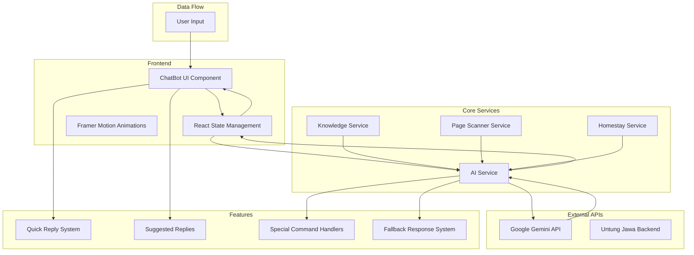
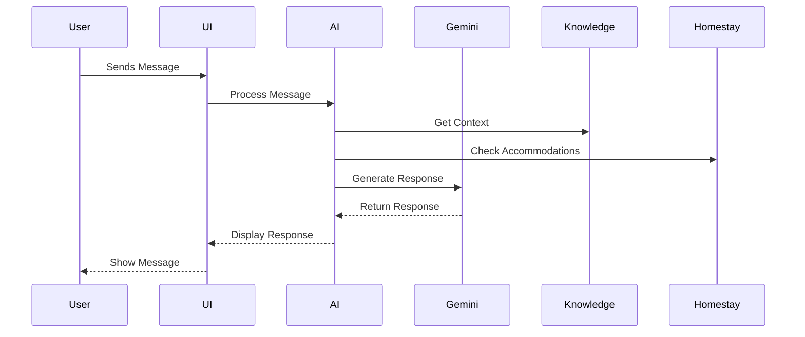
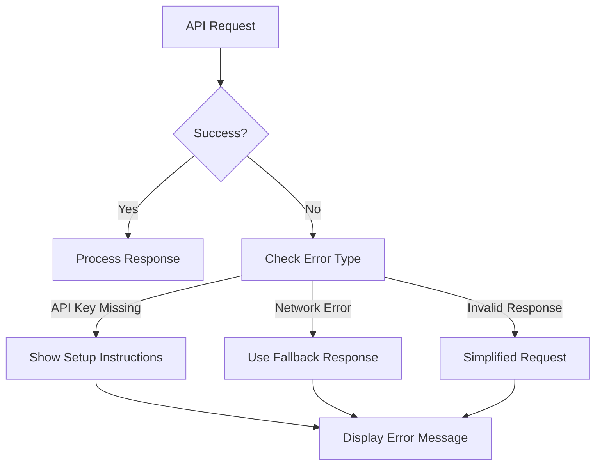
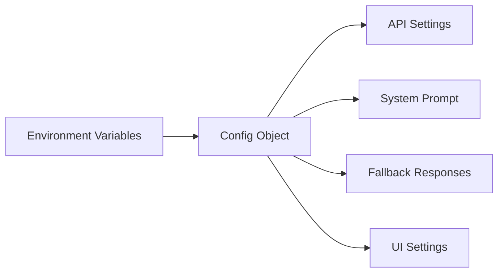
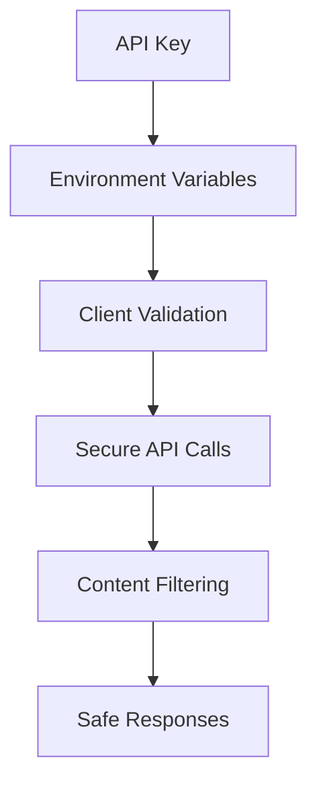

# Untung Jawa Chatbot Architecture

## System Overview

## Component Details

### Frontend Components
- **ChatBot UI**: Main interface component with island-themed design
- **State Management**: React hooks for managing chat state
- **Animations**: Framer Motion for smooth transitions and effects

### Core Services
- **AI Service**: Handles communication with Gemini API
- **Knowledge Service**: Manages tourism knowledge base
- **Page Scanner**: Provides context-aware responses
- **Homestay Service**: Manages accommodation data

### Features
- **Quick Reply System**: Pre-defined common queries
- **Suggested Replies**: Dynamic response suggestions
- **Special Handlers**: Custom logic for specific queries
- **Fallback System**: Backup responses when API fails

## Data Flow

## Error Handling

## Configuration System

## Security Measures

