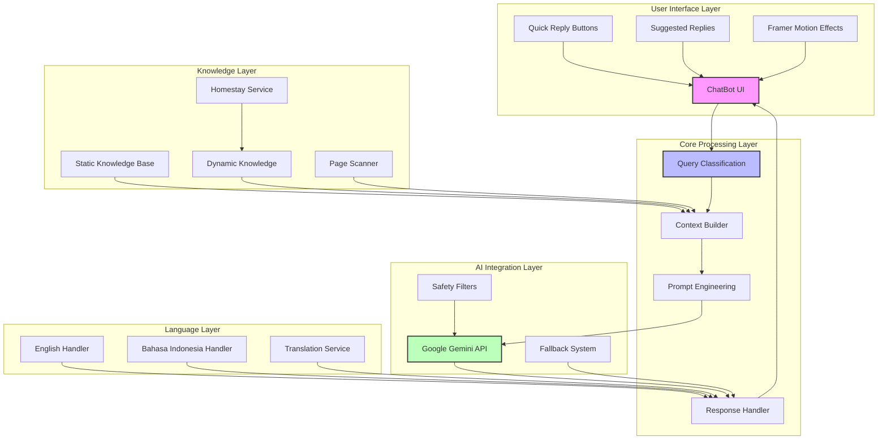
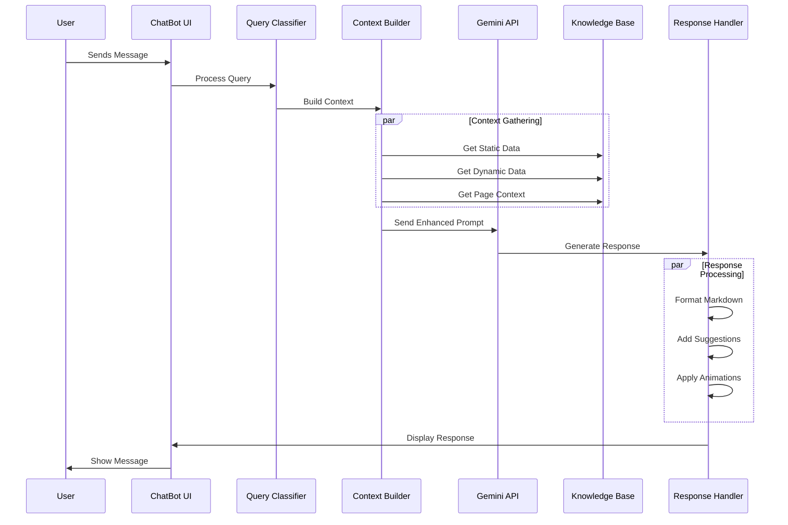
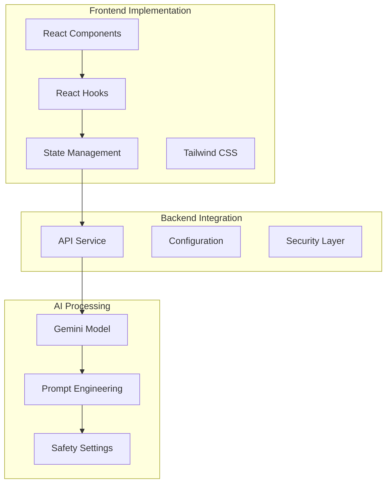
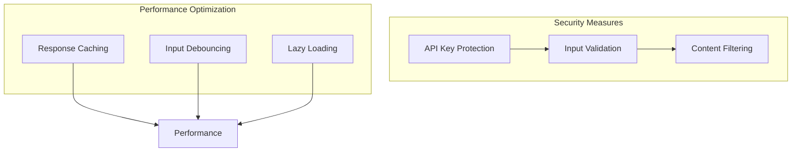

# Pulau Pal - Untung Jawa AI Chatbot Architecture

## System Overview

## Detailed Flow Diagram

## Key Components

### 1. User Interface Layer
- **ChatBot UI**: Beautiful island-themed interface with floating orb design
- **Quick Reply System**: Pre-defined common queries with island-themed icons
- **Suggested Replies**: Dynamic response suggestions based on context
- **Animations**: Smooth transitions and typing effects

### 2. Core Processing Layer
- **Query Classification**: Distinguishes between tourism and general queries
- **Context Builder**: Gathers relevant information from multiple sources
- **Prompt Engineering**: Creates optimized prompts for Gemini API
- **Response Handler**: Processes and formats AI responses

### 3. Knowledge Layer
- **Static Knowledge Base**: Island information, attractions, activities
- **Dynamic Knowledge**: Real-time homestay availability and pricing
- **Page Scanner**: Context-aware responses based on current page
- **Homestay Service**: Manages accommodation data and bookings

### 4. AI Integration Layer
- **Gemini API**: Google's advanced language model integration
- **Safety Settings**: Content filtering and moderation
- **Fallback System**: Backup responses for API failures

### 5. Language Layer
- **English Handler**: Primary language support
- **Bahasa Indonesia Handler**: Local language support
- **Translation Service**: Seamless language switching

## Innovation Highlights

1. **Context-Aware Intelligence**
   - Real-time page context integration
   - Dynamic knowledge base updates
   - Personalized response generation

2. **Island-Themed Experience**
   - Beautiful UI with mystical animations
   - Themed quick replies and suggestions
   - Engaging user interaction design

3. **Robust Error Handling**
   - Graceful fallback system
   - API failure recovery
   - User-friendly error messages

4. **Multi-Language Support**
   - Seamless language switching
   - Cultural context awareness
   - Local language optimization

## Technical Implementation

## Security and Performance

